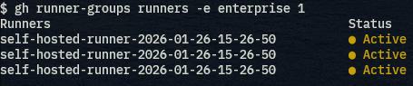

# gh-runner-groups

GitHub CLI extension for managing self-hosted runner groups in GitHub Enterprise

## Overview

`gh-runner-groups` is a powerful GitHub CLI extension that allows you to list and manage self-hosted runner groups and runners in GitHub Enterprise environments. It provides an easy way to view runner group information and check the status of runners within those groups.

## Installation

Install the extension using the GitHub CLI:

```bash
gh extension install buty4649/gh-runner-groups
```

## Features

- **List Runner Groups**: Display all runner groups in an enterprise
- **View Runners**: List all runners in a specific runner group with status information
- **Status Display**: Color-coded status indicators (Active, Idle, Offline)
- **Flexible Hosting**: Support for both GitHub.com and GitHub Enterprise Server
- **Aligned Output**: Clean, tabular display with proper alignment

## Usage

### List Runner Groups

List all runner groups in an enterprise:

```bash
# For GitHub.com
gh runner-groups list --enterprise myorg

# For GitHub Enterprise Server (using flag)
gh runner-groups list --enterprise myorg --hostname github.example.com

# For GitHub Enterprise Server (using environment variable)
GH_HOST=github.example.com gh runner-groups list --enterprise myorg
```

### List Runners in a Group

List all runners in a specific runner group:

```bash
# For GitHub.com
gh runner-groups runners 123 --enterprise myorg

# For GitHub Enterprise Server (using flag)
gh runner-groups runners 123 --enterprise myorg --hostname github.example.com

# For GitHub Enterprise Server (using environment variable)
GH_HOST=github.example.com gh runner-groups runners 123 --enterprise myorg
```

### Check Version

Display the current version:

```bash
gh runner-groups version
```

## Output Example

When listing runners, the output shows aligned information with color-coded status:



The output includes:
- Runner name (left-aligned)
- Status with color coding:
  - 🟢 **Active**: Runner is currently processing jobs
  - 🟡 **Idle**: Runner is online and waiting for jobs
  - 🔴 **Offline**: Runner is not responding

## Command Line Options

### Global Flags

- `--enterprise`, `-e`: Enterprise name (required)
- `--hostname`, `-H`: GitHub hostname for Enterprise Server (optional)
- `--help`, `-h`: Display help information

### Environment Variables

- `GH_HOST`: GitHub hostname for Enterprise Server (alternative to `--hostname` flag)

## Authentication

This extension uses the GitHub CLI's authentication. Make sure you're logged in with appropriate permissions:

```bash
gh auth login
```

For Enterprise Server, ensure your token has the necessary scopes to access runner information.

## Requirements

- GitHub CLI (`gh`) installed and authenticated
- Access to GitHub Enterprise with runner group permissions
- Go 1.25+ (for building from source)

## Building from Source

```bash
git clone https://github.com/buty4649/gh-runner-groups.git
cd gh-runner-groups
go build -o gh-runner-groups
```

## Development

### Running Tests

```bash
go test ./...
```

### Running with Race Detection

```bash
go test -race ./...
```

### Linting

```bash
golangci-lint run
```

## Contributing

1. Fork the repository
2. Create a feature branch
3. Make your changes
4. Add tests if applicable
5. Run tests and linting
6. Submit a pull request

## License

MIT License - see [LICENSE](LICENSE) file for details.

## Support

If you encounter issues or have feature requests, please [open an issue](https://github.com/buty4649/gh-runner-groups/issues) on GitHub.